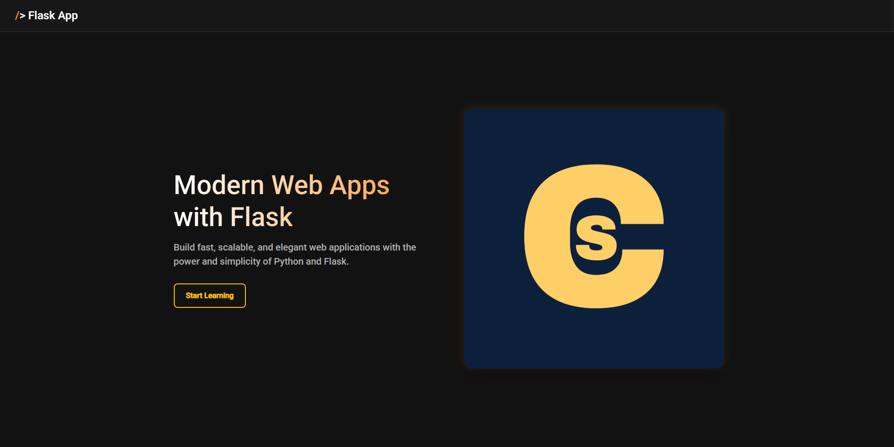

# Modern Flask Web App Prototype



This is a prototype of a modern web application built with Flask. It features a clean, responsive design, handles environment variables for configuration, and includes a custom-styled 404 error page.

## Features

- **Modern UI/UX:** Clean, responsive, and animated user interface.
- **Flask Backend:** Simple and powerful Python-based backend.
- **Environment-based Configuration:** Uses a `.env` file for easy local development configuration (e.g., setting the `PORT`).
- **Custom 404 Page:** A styled and user-friendly "Not Found" page.
- **Production Ready:** Includes `gunicorn` in `requirements.txt` for deployment.

## Prerequisites

- Python 3.x
- pip (Python package installer)

## Setup & Installation

1.  **Clone the repository:**
    ```bash
    git clone <your-repo-url>
    cd flask-template
    ```

2.  **Create a virtual environment (recommended):**
    ```bash
    python -m venv venv
    source venv/bin/activate  # On Windows, use `venv\Scripts\activate`
    ```

3.  **Install the dependencies:**
    ```bash
    pip install -r requirements.txt
    ```

4.  **Configure your environment:**
    -   Create a file named `.env` in the project root.
    -   Add your environment variables. You can start by copying the example:
    ```
    # .env
    PORT=5000
    ```

## Running the Application

You can run the application in two ways:

1.  **Using the `flask` command (for development):**
    ```bash
    flask run
    ```
    The application will be available at `http://127.0.0.1:5000` (or the port you specified in `.env`).

2.  **Using `python`:**
    ```bash
    python app.py
    ```

## Deployment

For production, it is recommended to use a production-grade WSGI server like Gunicorn.

```bash
gunicorn --bind 0.0.0.0:$PORT app:app
```
This command will start Gunicorn, binding it to the port specified in your environment variables.
